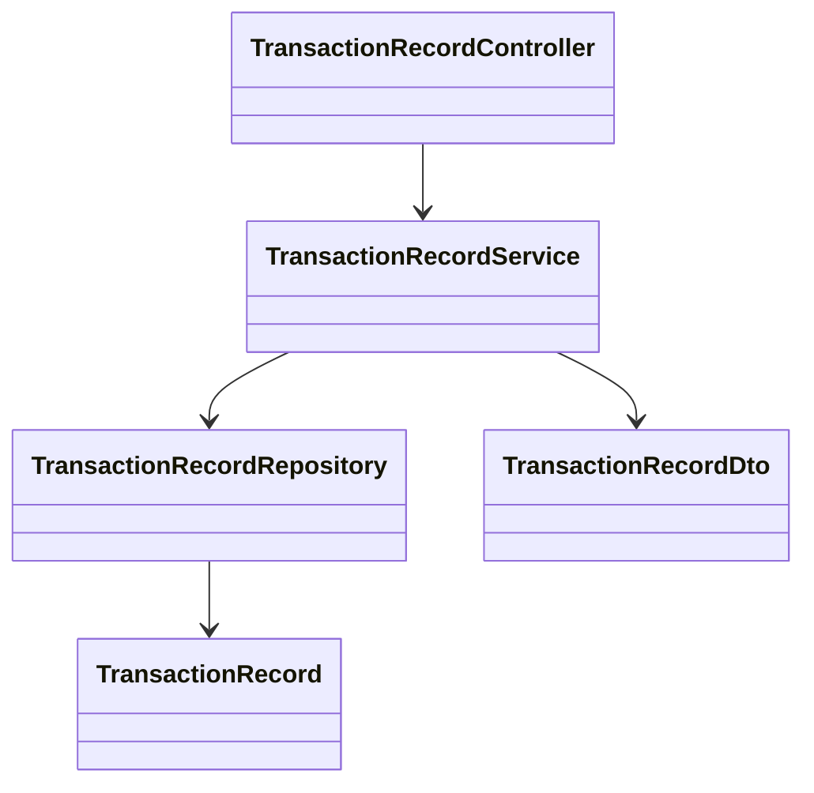
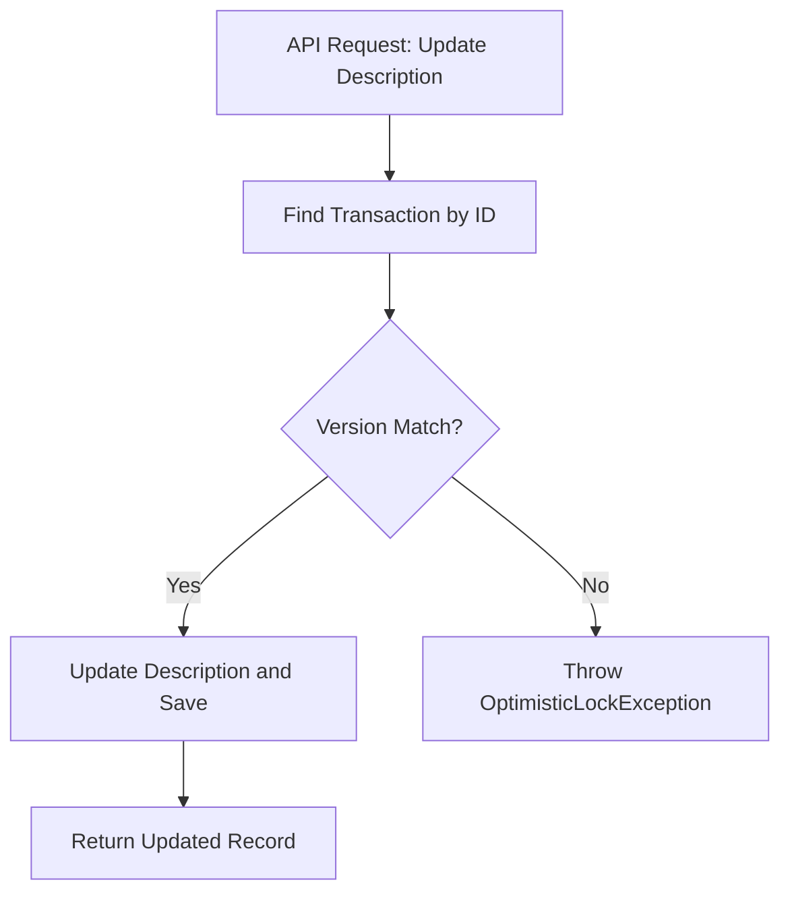

# Design Documentation

## Design Patterns Used

- **Repository Pattern:** Used for data access abstraction.
- **Service Layer Pattern:** Business logic is encapsulated in the service layer.
- **DTO Pattern:** To decouple API layer from entity model.
- **Specification Pattern:** For dynamic querying/search.
- **Optimistic Locking:** Using JPA @Version for concurrent update control.
- **Spring Batch:** For batch data import.

## Class Diagram

## Activity Diagram for Update API

